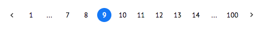

# AngularJeePagination


# Installation
npm install
`npm install angular-jee-pagination --save` <br />

Once installed, you can import jeePagination component into any application’s app.module.ts, by including it in its @NgModule imports array… <br />
`import { JeePaginationModule } from 'angular-jee-pagination';` <br />

Now you can use jeePagination component with basic 3 parameters
`<jee-pagination`
`   [totalRecords]="pages"`
`   [perPage]="perPage"`
`   (controller)="paginationController($event)">`
`</jee-pagination>`


# Configuration

A complete list of JeePagination parameters can be found in the table below.

| Name | Type | Input/Output | Parameter description |
| ---- | ---- | ------------ | --------------------- |
| `totalRecords` | Number | @Input | (required) The total number of items. |
| `perPage` | Number | @Input | (required) How many items per page (required). |
| `showBefore` | Number | @Input | (optional) How many page can i see before current page (2 By default). |
| `showAfter` | Number | @Input | (optional) How many page can i see after current page (3 By default). |
| `specificPage` | Boolean | @Input | (optional) Show or hide input box (true By default). |
| `controller` | Function($event) | @Output | (required) This function will call when the page change.it takes a 'pageNumber' as a parameter |


# Development

1. Download and install NodeJS so you can use NPM: <br />
  https://nodejs.org/download/

2. From the Terminal, navigate to the project directory and run in the following order: <br />
 ```npm install``` <br />
 ```ng serve```